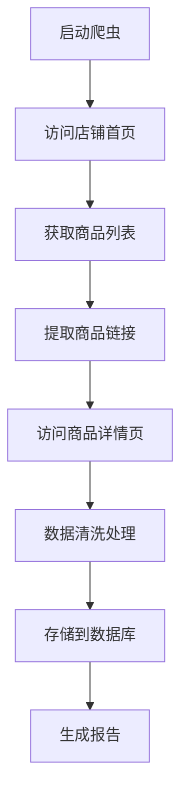

# 1688店铺商品数据爬虫需求文档

## 1. 产品概述

本项目旨在开发一个专门针对1688阿里巴巴批发网店铺的商品数据爬虫系统，用于自动化采集指定店铺的所有商品信息。
- 目标网站：1688.com（阿里巴巴批发网）
- 具体店铺：https://shop0209605420047.1688.com/page/offerlist.htm
- 解决电商数据采集、价格监控、商品分析等业务需求

## 2. 核心功能

### 2.1 用户角色

| 角色 | 使用方式 | 核心权限 |
|------|----------|----------|
| 数据分析师 | 直接运行脚本 | 可获取完整商品数据，导出分析报告 |
| 运营人员 | 定时任务执行 | 可查看商品价格变化，监控竞品信息 |

### 2.2 功能模块

我们的1688爬虫系统包含以下主要页面：
1. **数据采集页面**：商品列表获取、分页处理、详情页抓取
2. **数据处理页面**：数据清洗、格式化、去重处理
3. **数据存储页面**：数据库存储、文件导出、API接口
4. **监控管理页面**：爬虫状态监控、错误日志、性能统计

### 2.3 页面详情

| 页面名称 | 模块名称 | 功能描述 |
|----------|----------|----------|
| 数据采集页面 | 商品列表爬取 | 获取店铺所有商品链接，处理分页逻辑，提取基础商品信息 |
| 数据采集页面 | 商品详情抓取 | 访问单个商品详情页，提取完整商品信息（名称、价格、图片、规格等） |
| 数据采集页面 | 反爬虫处理 | 设置请求头伪装、IP代理轮换、访问频率控制、验证码处理 |
| 数据处理页面 | 数据清洗 | 去除HTML标签，格式化价格数据，处理特殊字符，数据类型转换 |
| 数据处理页面 | 数据验证 | 检查数据完整性，验证价格合理性，过滤无效商品信息 |
| 数据存储页面 | 数据库操作 | 连接MySQL/MongoDB，批量插入数据，更新商品信息，处理重复数据 |
| 数据存储页面 | 文件导出 | 导出Excel/CSV格式，生成JSON数据文件，创建数据报告 |
| 监控管理页面 | 状态监控 | 实时显示爬虫运行状态，统计成功/失败次数，监控内存使用 |
| 监控管理页面 | 日志管理 | 记录详细操作日志，错误信息追踪，性能指标分析 |

## 3. 核心流程

**主要操作流程：**
1. 初始化爬虫配置（设置请求头、代理、延时等参数）
2. 访问店铺首页，获取商品总数和分页信息
3. 遍历所有分页，提取商品列表中的基础信息和详情页链接
4. 并发访问商品详情页，提取完整的商品信息
5. 数据清洗和验证，确保数据质量
6. 存储到数据库或导出为文件格式
7. 生成爬取报告和统计信息

## 4. 用户界面设计

### 4.1 设计风格
- 主色调：蓝色(#1890ff)，辅助色：灰色(#f0f2f5)
- 按钮样式：圆角矩形，悬停效果
- 字体：微软雅黑，主要字号14px，标题18px
- 布局风格：简洁的卡片式布局，左侧导航栏
- 图标风格：线性图标，统一的视觉风格

### 4.2 页面设计概览

| 页面名称 | 模块名称 | UI元素 |
|----------|----------|--------|
| 数据采集页面 | 配置面板 | 输入框（店铺URL）、下拉选择（爬取模式）、滑块（并发数量）、开始按钮 |
| 数据采集页面 | 进度显示 | 进度条、实时统计数字、状态指示灯、日志滚动窗口 |
| 数据处理页面 | 数据预览 | 表格展示、分页控件、搜索框、筛选器 |
| 数据存储页面 | 导出选项 | 格式选择按钮、文件名输入、下载按钮、历史记录列表 |
| 监控管理页面 | 仪表盘 | 圆形进度图、折线图（性能趋势）、状态卡片、告警提示 |

### 4.3 响应式设计
桌面优先设计，支持1920x1080及以上分辨率，考虑数据展示的清晰度和操作便利性。